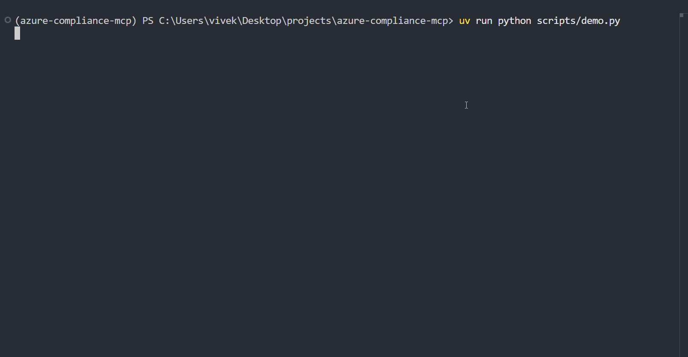
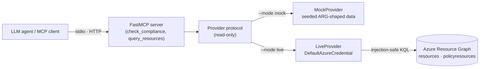

# azure-compliance-mcp

[](https://github.com/vivekanjana76/azure-compliance-mcp/actions/workflows/ci.yml)
[](./LICENSE)
[](https://www.python.org/)
[](https://gofastmcp.com)

> **Honest Azure compliance for LLM agents** — ask infra-health questions in plain English and get answers that distinguish a real `fail` from a `not_evaluable`, and **never fake a `pass`**.

An [MCP](https://modelcontextprotocol.io) server, built with **[FastMCP](https://gofastmcp.com) 3.x**, that exposes read-only Azure resource-compliance data so an agent can answer questions like *"which storage accounts allow TLS 1.0?"* or *"which VMs have no disk encryption?"* — each finding tagged with **where the verdict came from** and **whether it could be evaluated at all**.

<!--  — added in the demo-gif PR -->

> 🎬 Demo GIF coming in the next commit.

## Why honest compliance?

Most tooling collapses "compliant", "non-compliant", and "couldn't tell" into a single pass/fail bit — so a control it *can't actually measure* silently shows green. This server refuses to guess:

- **`fail`** — positive evidence a protection is absent (e.g. `encryptionAtHost = false`). Actionable; shows up in the default view.
- **`not_evaluable`** — the signal genuinely isn't in the data (e.g. no guest-config policy assigned). Surfaced explicitly, never as a pass.
- **`source`** — every finding records its provenance: `arg` | `azure_policy` | `defender`.

## Quickstart

Requires [uv](https://docs.astral.sh/uv/) and Python 3.12+. **Runs out of the box** — mock mode needs zero Azure setup.

```bash
uv sync                          # install dependencies
uv run server.py                 # mock data, stdio transport — works immediately
```

Point it at your own tenant when you're ready:

```bash
uv run server.py --mode live     # real Azure Resource Graph (e.g. after `az login`)
uv run server.py --transport http  # remote: Streamable HTTP
uv run fastmcp dev inspector server.py  # explore the tools interactively
```

Live mode authenticates with `DefaultAzureCredential` against **your own** tenant and is strictly read-only.

## Architecture

Tools depend only on a `Provider` **protocol**, never on a concrete data source — so the *same* tool code runs against synthetic mock data or live Azure Resource Graph (ARG), selected at startup with `--mode`.



**Controls** (`check_compliance` evaluates five):

| control | source | signal |
|---|---|---|
| `required_tags` | `arg` | `resources.tags` (env / owner / costCenter) |
| `tls_min_1_2` | `arg` | `resources.properties.minimumTlsVersion` |
| `public_network_access` | `arg` | `resources.properties.publicNetworkAccess` |
| `disk_encryption` | `arg` | `securityProfile.encryptionAtHost` — host-level only; OFF ⇒ `fail`, ADE not assessed |
| `guest_config_extension` | `azure_policy` | `policyresources` guest-config states; no data ⇒ `not_evaluable` |

**Transports:** `stdio` (default, local) and Streamable HTTP (remote, intended behind OAuth 2.1). In stdio mode stdout is reserved for the protocol — logging goes to stderr only.

See [`SPEC.md`](./SPEC.md) for the full tool contracts.

## Design decisions & tradeoffs

- **Mock provider is the default.** The repo runs with zero Azure account, credentials, or network — so reviewers, CI, and new contributors get meaningful output immediately. The mock dataset is shaped exactly like ARG rows, so one mapping serves both modes.
- **Read-only by construction.** No tool can create, update, or delete a resource. The live path only ever issues ARG *queries*; there is no mutation surface to misuse.
- **Control-based, not Azure-Policy-based.** Compliance is evaluated from resource *configuration* (the ARG row), so it works even when no Azure Policy is assigned — except where the signal genuinely lives elsewhere (guest-config), which routes to `policyresources` and is honest about it.
- **The `not_evaluable` + `source` honesty model.** A third status plus a provenance field means the agent can tell "this is broken" from "I can't see this from here" — the core reason to trust the output.
- **KQL pushdown for scale.** Live filters (`query_resources`) are pushed *into* the ARG query (`where` + `take`) rather than fetched-then-filtered, so large tenants stay cheap. An opt-in contract test asserts the pushdown matches the reference Python filter, so both modes stay provably consistent.
- **Injection-safe escaping.** ARG has no bind parameters, so every user-supplied value is encoded as an escaped KQL string literal — never concatenated raw. (ARG is read-only regardless, but the discipline is enforced and unit-tested.)

## Status & roadmap

**v0.2.0** — `check_compliance` and `query_resources` shipped (mock + live), honest `not_evaluable`/`source` model, KQL pushdown, CI on every PR.

Next:

- [ ] `get_patch_status` — patch/update assessment across VMs
- [ ] `find_orphaned_rbac` — role assignments pointing at deleted principals
- [ ] `summarize_health` — rolled-up infra-health summary
- [ ] evals — task-level evaluation of agent answers over the mock dataset

## Development

```bash
uv run pytest               # tests (live tests are opt-in: RUN_LIVE_TESTS=1)
uv run ruff check .         # lint
uv run ruff format --check . # format
```

## Security

- All Azure tools are **read-only** — nothing in this server modifies Azure resources.
- Secrets, tenant IDs, and `.env` are gitignored and must never be committed; live mode uses only your local `DefaultAzureCredential`.
- In stdio mode, logging goes to **stderr only** (stdout is reserved for the protocol).

## License

[MIT](./LICENSE)
